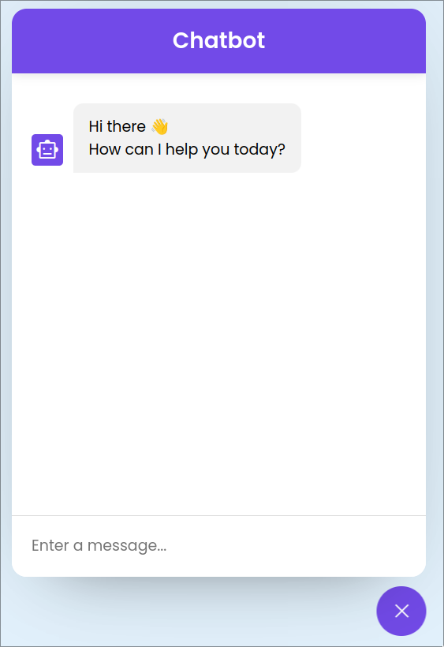

# Chatbot-openAPI

 

    Welcome to the Chat App! This is a simple chat application that has been created
    using Open API and API key integration, allowing it to be easily integrated into 
    any website. The app comes with a sleek and cool user interface to enhance the
    user experience.

 

<bold>Real-time Chat:</bold> Users can send and receive messages in real-time, creating a seamless chatting experience. 

<bold>Open API Integration:</bold> The app is built using an open API, making it easy to integrate with other platforms and systems. 

<bold>API Key:</bold> To ensure secure access and usage, the app requires an API key that you can obtain by following the instructions below. 

<bold>Customizable UI:</bold> The app boasts a cool user interface that can be further customized to match the look and feel of your website. 

